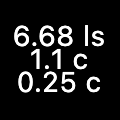

# Warp Wake Simulator

A simple simulator that showcases the strange behaviors of warp drive wakes.
This project aims to give people some kind of an intuition for what it would look/feel
like to track spacecraft utilizing FTL devices akin to the [Alcubierre warp drive](https://en.wikipedia.org/wiki/Alcubierre_drive).

Download a release [here](https://github.com/skylon07/warp_wake_simulator/releases).
While this code is licensed under the MIT license, I'd appreciate being
credited if you use it in your own work. I'd also love to hear whatever you're
working on! Feel free to reach me at skylon07.dsc@gmail.com.

Feel free to file an issue for any feature requests you have or bugs you find.

## Features

To understand the purpose of the simulator, let's dissect its visual elements.

#### Green

This is "you". Or, at least a really crappy representation of "your spaceship".
Everything in the simulator is calculated relative to the center(ish) of this entity.
Its name is "Green".

#### Red

This is "Red". You can think of this as Green's "target". Red is responsible for
emitting the warp wakes Green observes. However, Red is never observed by Green
directly; the next section explains this more.

#### Pink

"Pink" is not an entity in the same way as Red and Green, which represent real spacecraft.
Rather, Pink is a version of Red, a "ghost" of sorts, that appears whenever and
wherever Green would be able to see Red's wake. This means if Green were looking
for Red, they would see them at Pink's position. In a sense, you could say
Pink is the "star" of this simulation, hehe.

#### Wake Rings

These colored flowing circle things are a toggleable feature of this simulation.
Wake rings must always be calculated to display Pink, but rendering them directly
can help give an explanation for certain FTL phenomenon. They also just look really cool.

Not all wake rings are rendered for performance reasons. Firstly, only "unobserved"
wake rings have a chance to be rendered. Not all of them are though. The number
of rendered rings decreases adaptively as the number of "unobserved" rings increases.

By default, this feature is turned off. It can be enabled via its associated keybinding.

#### Metrics

These numbers are shown below Green. They indicate (in order)
- the distance in light-seconds between Red and Green
- the effective warp speed of Green
- the effective warp speed of Red

It's important to note that everything in this simulator exists in the same
inertial frame. In other words, Green and Red are "at rest" relative to each other
at all times, in the relativistic sense. (If that's confusing, it might be helpful
to think of the warp drives as giving the spacecraft a kind of "slow teleport".)

#### Scenarios

The last feature to mention is the "scenario" system. Hitting `0` on your keyboard
will reset the simulator to the default "sandbox" scenario. `1-9` will start
other interesting scenarios I've come up with (if they're implemented). You can
also still control both ships while these scenarios play out.
